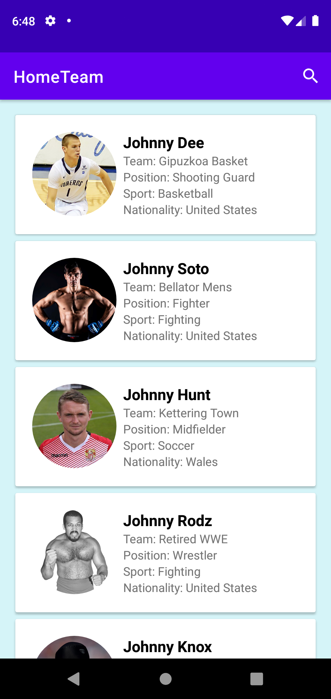
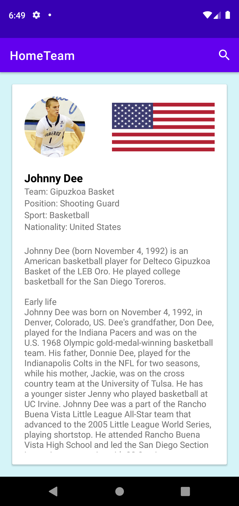

# Home-Team

## Description

An android App that allows you to search athletes and select them to learn more about them. When you users search an atheletes name the search is also logged in a seperate MySQL database on Heroku so moniter what the most common searches on this app are.

## Table of Contents

* [Installation](#installation)
* [Usage](#usage)
* [Credits](#credits)
* [Features](#features)
* [Contributing](#contributing)
* [Tests](#tests)
* [Questions](#questions)

## Installation

Clone the repo and open the root of the root of the repo in android studio. Let Gradle build the project, once gradle is complete Press the run button in android studio and the application should launch in your configured editor.

## Usage

To use this application press the search button on the top right and type in the name of an athelete, for example "Michael Jordan". Hit enter on the android keyboard and the application will query atheletes relevent to your search. Find the athelete you are searching for and click on it the athletes card to view more information on that athelete. Press Androids back button to navigate to the previous screen or click the search button in the top right to start another query.

## Credits

Glide, lifecycle, OKHTTP3, GSON, recyclerview, cardview

## Features

* Search Athletes names
* View Athelete Bio
* See the most commonly search athletes [https://home-team-tracker.herokuapp.com/](https://home-team-tracker.herokuapp.com/)

## Contributing

If you would like to contribute to my first android app please fork this repository and submit a pull request explaining what features you have added and why you think the app need this feature.

## Tests

There are no tests currently setup as this is my first android project/kotlin project

## Questions

Find me on github here: [here](http://github.com/Moonryc)

If you have any additional question feel free to email me at [RycMoon@gmail.com](mailto:RycMoon@gmail.com)
